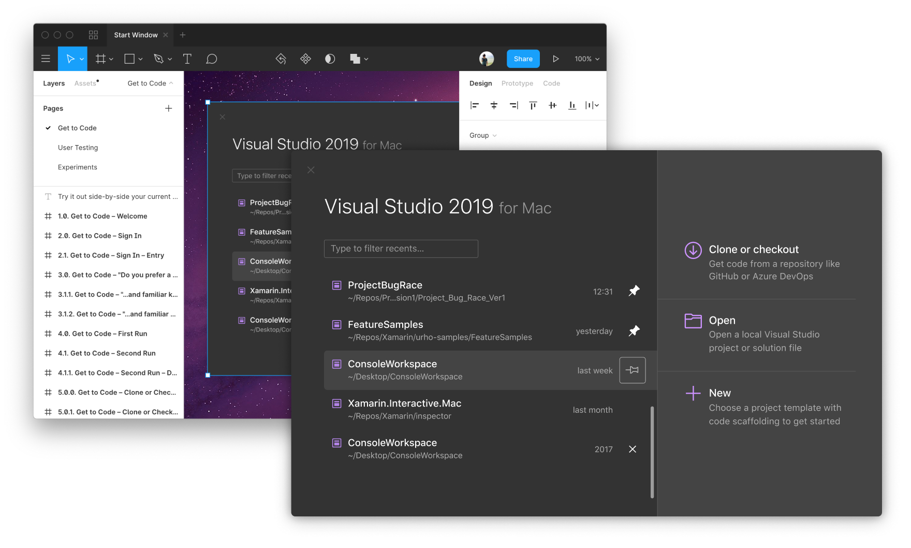

# FigmaSharp – Create apps with Figma

> Here at Microsoft we ❤️ [Figma](https://www.figma.com/). We use it for everything and anything. So much so, we thought why not use it to actually implement our user interfaces? Sounds crazy enough to work. Let's give this a go. 

FigmaSharp turns your Figma design into .NET objects and can generate code and layout files to create native apps. Free and Open Source software under the [MIT LICENSE]().

# Getting started

We recommend reading through the [Wiki](https://github.com/micosoft/FigmaSharp/wiki) to get a sense of the FigmaSharp workflow.

To get documents from [figma.com](https://www.figma.com/) you'll need to generate a **Personal Access Token**.
Sign in to Figma and in the main menu, go to **Help and Account  →  Account Settings** and select **Create new token**.
This will be your only chance to copy the token, so make sure you keep a copy in a secure place.

Try out automatic builds of the FigmaSharp app and Visual Studio extension from the [Releases](https://github.com/microsoft/FigmaSharp/releases) page. 

Do you have questions, need support, or want to contribute? Join the [chat on Discord](https://discord.gg/F3GEYqp).

 

## Visual Studio extension

The [Visual Studio for Mac](https://visualstudio.microsoft.com/vs/mac/) extension contains the tools to preview Figma documents and generate Packages ready to use in your projects. Download the .mpack from the [Releases](https://github.com/microsoft/FigmaSharp/releases) page. 

 

## FigmaSharp app

The app previews Figma documents without having to install Visual Studio. Download the .app from the [Releases](https://github.com/microsoft/FigmaSharp/releases) page.

 

## Building from source

To run the samples, open `FigmaSharp.Mac.sln` in [Visual Studio for Mac](https://visualstudio.microsoft.com/vs/mac/).
In each sample project's **Project Options**, go to **Run → Configurations → Default** and add an environment variable called `TOKEN`, then paste in your Personal Access Token.

 

 

 

 

 

 

Keep calm and hack the planet.
 
